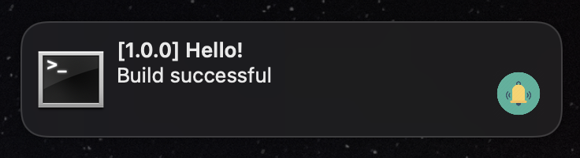

# Custom Notifications for Laravel Mix





Laravel Mix extension to display notifications from Mix when your project will build.

The package uses webpack-plugin `webpack-notifier`

## Install

```bash
npm install laravel-mix-notifier --save-dev
```

## Usage

```javascript
const mix = require('laravel-mix')
require('laravel-mix-notifier')

mix.notify()
mix.notify({
  title: 'Hello!',
  contentImage: 'assets/logo.png',
  version: '12.2.2-dev',
  showVersion: false,
})
```

* `title` - Notification's title. Default: load from your `package.json` from `description` field
* `contentImage` - Image that show in notifications
* `version` - Version. Default: load from your `package.json` from `version` field
* `showVersion` - Show version in the `title`. Default: `true`
